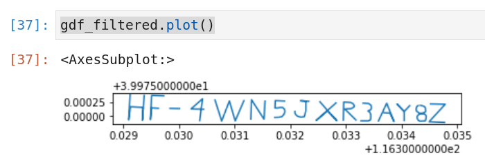

We are given a container image to run for this challenge:

```shell
$ podman run --name data-stalker -p 8888:8888 -d public.ecr.aws/r0i2o0f6/data-stalker
```

Navigating to http://localhost:8888 brings us into a python jupyter notebook with the challenge.

There is a dataset being loaded into a GeoPandas DataFrame with a lot of chinese citizen. It is then overlaid on a leaflet map of the earth. There are just a ton of tracks of citizens walking all over the world.

The title of the challenge contains some chinese characters. According to Google Translate, 斐波那契 Translates to "Fibonacci". This clued me in that we might need to filter citizens by `citizen_id` with ids matching the fibonacci sequence. I determined that 16 iterations of the fibonacci sequence were sufficient to reach the upper bound of the `citizen_id` values.

I came up with the following python to do the filtering and plotting:

```python
import geopandas as gpd

gdf = gpd.read_parquet("geodata.parquet")

def recur_fibo(n):
   if n <= 1:
       return n
   else:
       return(recur_fibo(n-1) + recur_fibo(n-2))
    
fib = []
for i in range(16):
    fib.append(recur_fibo(i))

gdf_filtered = gdf.query('citizen_id in @fib')
display(gdf_filtered)

gdf_filtered.plot()
```

I didn't even need to plot the data on the leaflet map, just a simple plot was sufficient to reveal the flag:



🚩