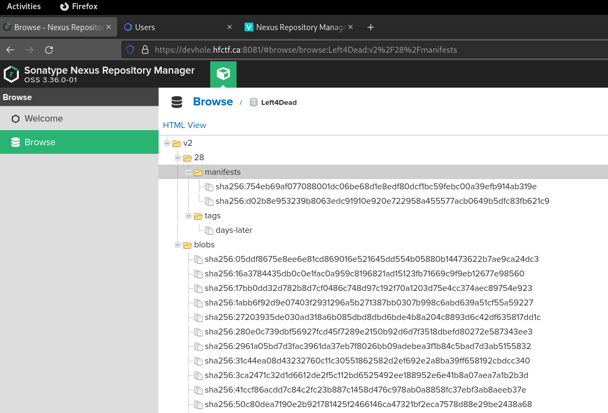

# LvlUp 01 - Dream Home

This track started out by giving us the `devhole.hfctf.ca` hostname to investigate.

The first instinct was to scan every TCP port on the hostname.

```shell
$ nmap -Pn -p1-65535 -sV -O 34.230.197.82/32 -T4
Starting Nmap 7.92 ( https://nmap.org ) at 2021-11-19 20:34 EST
Nmap scan report for ec2-34-230-197-82.compute-1.amazonaws.com (34.230.197.82)
Host is up (0.011s latency).
Not shown: 65530 filtered tcp ports (no-response)
PORT     STATE SERVICE  VERSION
3000/tcp open  ssl/http nginx
8080/tcp open  ssl/http nginx
8081/tcp open  ssl/http nginx
8888/tcp open  ssl/http nginx
8889/tcp open  ssl/http nginx
Warning: OSScan results may be unreliable because we could not find at least 1 open and 1 closed port
Device type: general purpose
Running (JUST GUESSING): Linux 2.6.X|3.X|4.X (90%)
OS CPE: cpe:/o:linux:linux_kernel:2.6.32 cpe:/o:linux:linux_kernel:3 cpe:/o:linux:linux_kernel:4
Aggressive OS guesses: Linux 2.6.32 (90%), Linux 3.2 - 4.9 (90%), Linux 2.6.32 - 3.10 (89%), Linux 2.6.32 - 3.13 (89%), Linux 3.10 - 3.13 (88%)
No exact OS matches for host (test conditions non-ideal).

OS and Service detection performed. Please report any incorrect results at https://nmap.org/submit/ .
Nmap done: 1 IP address (1 host up) scanned in 127.58 seconds
```

After some analysis, I identified the following services:

|Port|Service                |
|----|-----------------------|
|3000|Gitea                  |
|8080|Jenkins                |
|8081|Sonatype Nexus         |
|8888|Private Docker Registry|
|8889|Public Docker Registry |

I went for the low hanging fruit which was the Nexus instance who's web UI showed unauthenticated access to the docker registry accessible via port 8889.



I went ahead and visually inspected the json manifest for the `days-later` tag of the image available at https://devhole.hfctf.ca:8081/repository/Left4Dead/v2/28/tags/days-later

The full file is located in `days-later.json`.

In the manifest, I noticed that a layer was adding a flag.txt file to the image:

```json
{
    "v1Compatibility" : "{\"id\":\"a2bfb8798151656f29229dfdc0c86ff8586e7ae982c30ff8febfc43b7d33a836\",\"created\":\"2021-11-19T20:11:22.1820609Z\",\"Cmd\":{\"container_config\":\"/bin/sh -c #(nop) COPY file:232a2fa57354b855566da32903c6158e10b4138b9cccaa4473cdf6c92a898f5b in /flag.txt \"},\"parent\":\"3849e52cf9a0f6a288c8427d86db467748925bc5b4cd808e98d45c3ec75589dc\"}"
}
```

I then found the relevant blob entry using its index in the manifest.

```json
{
    "blobSum" : "sha256:c56368f8b4b04b99b5b0fe3736a76a5f840c83e60f4543ef8a07600dedcefdef"
}
```

Finally, I downloaded it and checked out what was inside.

```shell
$ wget https://devhole.hfctf.ca:8081/repository/Left4Dead/v2/-/blobs/sha256:c56368f8b4b04b99b5b0fe3736a76a5f840c83e60f4543ef8a07600dedcefdef
$ tar zxvf sha256\:c56368f8b4b04b99b5b0fe3736a76a5f840c83e60f4543ef8a07600dedcefdef
$ cat flag.txt
HF-912f296e-84f7-44dd-a889-b5f7b0dbf87f
```

🚩

**Note**: I could just have pulled the docker image with the docker cli but I hadn't figured out the port of the public registry at the time so I just went with what I could access through Nexus' UI. Plus, this was a good warmup for challenges to come as messing with manifests and blobs would become very useful in upcoming challenges