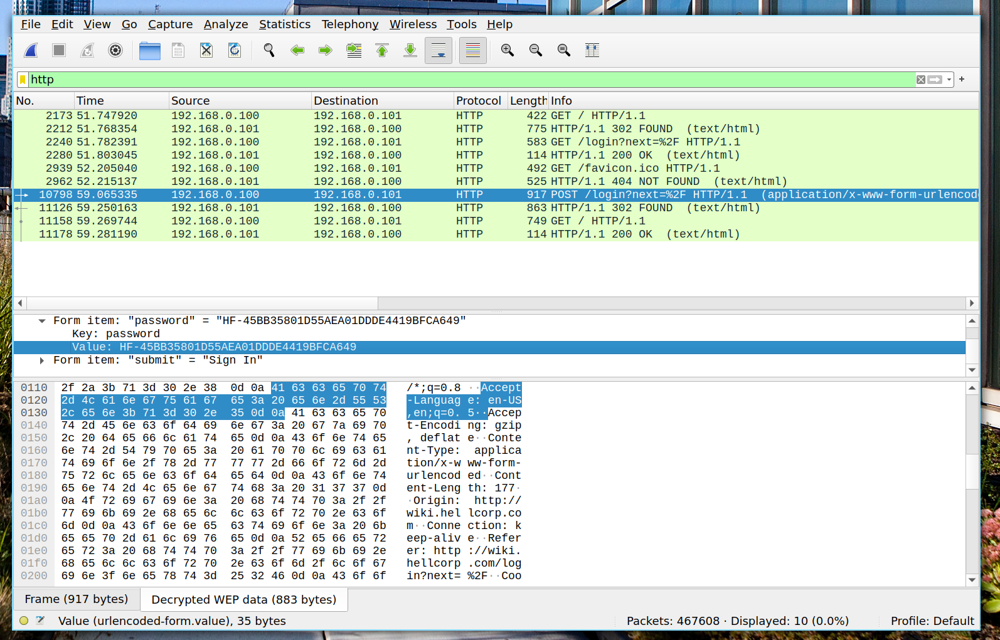

# 01 - Welcome (1 of 2)

We get a cap file containing a lot of encrypted wifi traffic and what appears to be a deauthentication attack to capture wifi traffic handshakes.

I started loading the cap file into wireshark. I then pressed `Wireless -> WLAN Traffic` to get the wireless traffic inspection window in wireshark. I was able to see that the HellCorp SSID was using WEP encryption... trivial to crack!

I immediately threw the cap file into `aircrack-ng` to recover the Wi-Fi passphrase.

```console
$ aircrack-ng ~/Downloads/hellcorp_1.cap
                                                          Aircrack-ng 1.6 


                                            [00:00:00] Tested 274748 keys (got 10996 IVs)

   KB    depth   byte(vote)
    0    4/ 23   68(14848) C8(14848) D3(14848) A1(14592) 58(14336) 88(14336) E5(14080) 5C(13824) 87(13824) 9B(13824) 
    1   14/ 18   33(13824) C4(13824) EC(13824) 11(13824) 10(13568) 5F(13568) 72(13568) 8D(13568) E2(13568) 45(13312) 
    2    8/ 11   91(14336) 28(14080) BC(14080) C8(14080) DA(14080) 3D(13824) 69(13824) 96(13824) CB(13824) E6(13824) 
    3   11/ 13   21(14080) 3C(14080) 52(13824) 6A(13824) 99(13824) C2(13824) 01(13568) D0(13568) DA(13568) E2(13568) 
    4    1/  5   43(15872) E7(15616) F3(15360) FF(15104) 3B(14848) AF(14848) A6(14336) 08(14080) E9(14080) 24(13824) 

                     KEY FOUND! [ 68:33:21:21:43 ] (ASCII: h3!!C )
	Decrypted correctly: 100%
```

We got the key `68:33:21:21:43`. I loaded that into wireshark using the `Edit -> Preferences -> IEEE 802.11` menu to get it to decrypt the traffic.

I then filtered the traffic by `http` protocol and immediately found an http request to log into the HellCorp wiki containing the plaintext password `HF-45BB35801D55AEA01DDDE4419BFCA649`.



🚩