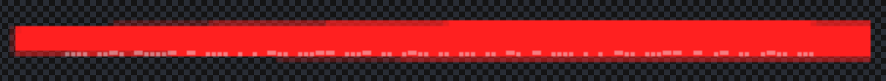

# 04 - Treatssomeware

This challenge uses the decompressed FS from HAUNTED. Given the description, we knew that we had to investigate the files of the website. We can try to grep for the flag format:

```
grep -rnw "/www" -e "HF-"
```

This does not return anything interesting... We can look at the remainder of the files. The `app.blink.css` we used in Treats is probably not interesting. The `app.90*.css` seems to be a common lib minified code. We can verify using the `app.90*.css.map` and there doesn't seem to be anything interesting. We can also go through the `/js/*` files and try to see if there is an interesting hidden command. Like for the CSS, all the files were standard.

We can conclude that the hint for "keep an eye out" probably indicated having to look at an image. The SVG could maybe have a hidden content in the XML? If we investigate the files - again nothing. Maybe we can look at the actual PNG images? All the PNG seem fairly standard except for the `/img/onion.png`. If we zoom into the image, there seems to be some difference between the red bar on the left and right. If we zoom further, we see the following:



This is obviously morse code. We can transcribe the code into a tool like: https://morsecode.world/international/translator.html to get the flag.
