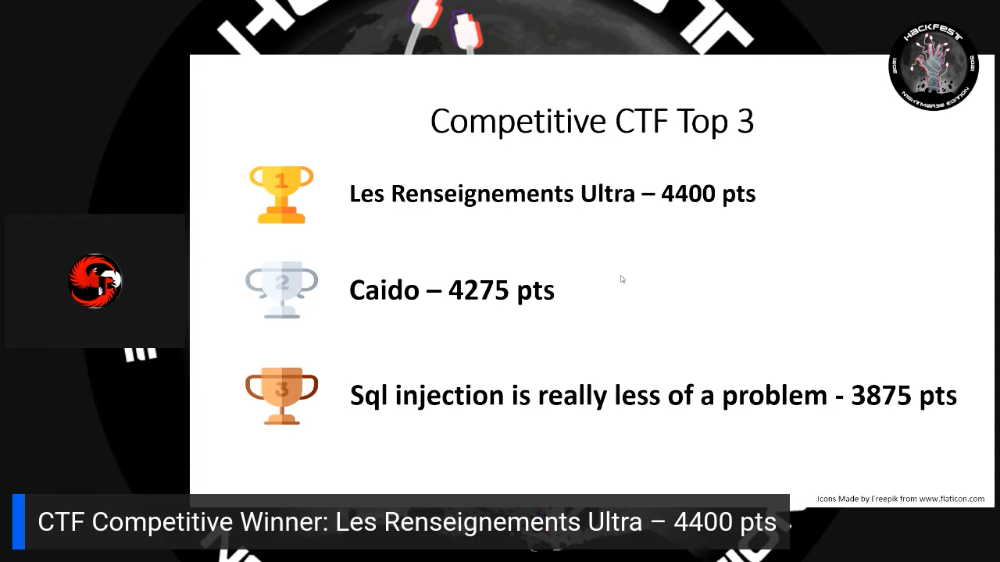
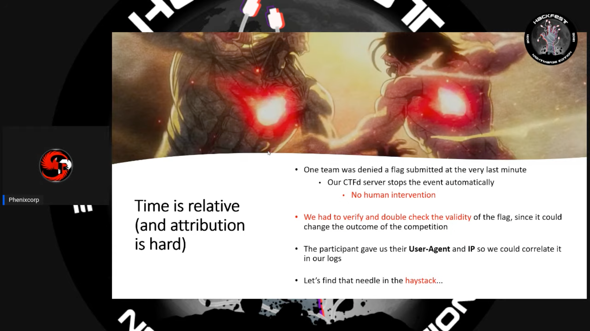
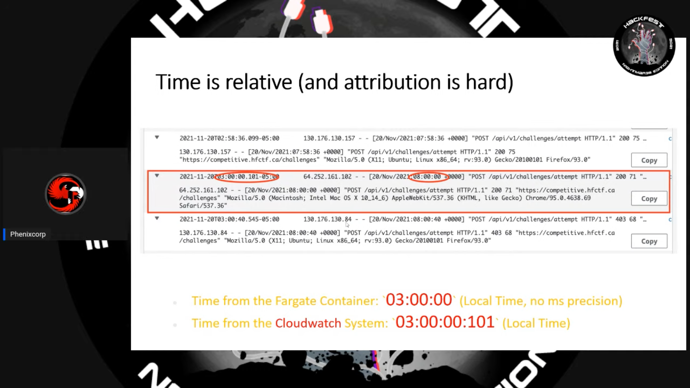

# Hackfest 2021: Competitive CTF 🚩

Write-ups and retrospectives from Les Renseignements Ultra at Hackfest
2021's Competitive CTF tournament. 

    

## 1st Place 🏆, by a Hundred Milliseconds  

Caido had been on our tail the entire night. They were about to beat us,
but submitted their flag a hundred milliseconds too late, as the system was
designed to shutdown at `02:59:59`. 

    

    

    

