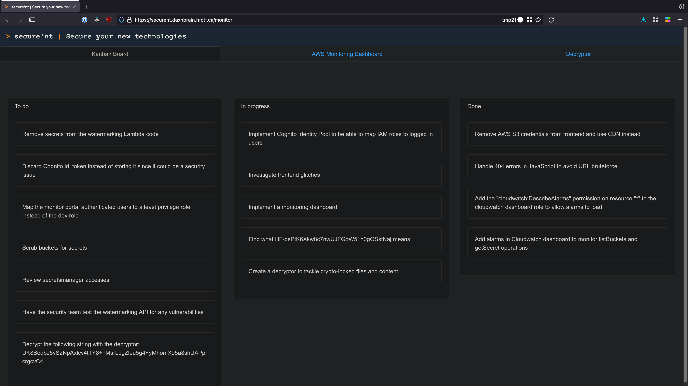

# 02 - Letting you in if you ask nicely

I ran the application's bundle through a JavaScript deobfuscator. Then, I discovered this credentials object:

```js
{
    userPoolDomain: "hf2021-securent",
    userPoolRegion: "us-east-1",
    userPoolClientId: "4inro09ih43ngggceg9rpk4bk5",
    cognitoIdentityPoolId: "us-east-1:136662d5-3980-434c-ae70-864bea48006c",
    userPoolClientResponseType: "token",
    userPoolClientScope: ["openid"]
}
```

And the existence of this function that builds a URL:

```js
cognitoUrl: function () {
    return "https://".concat(this.userPoolDomain, ".auth.").concat(this.userPoolRegion, ".amazoncognito.com/login?client_id=").concat(this.userPoolClientId, "&response_type=").concat(this.userPoolClientResponseType, "&scope=").concat(this.userPoolClientScope.join("+"), "&redirect_uri=").concat(this.redirectUrl)
}
```

I translated this into something I could use to build my own URL:

```js
var userPoolDomain = "hf2021-securent";
var userPoolRegion = "us-east-1";
var userPoolClientId = "4inro09ih43ngggceg9rpk4bk5";
var cognitoIdentityPoolId = "us-east-1:136662d5-3980-434c-ae70-864bea48006c";
var userPoolClientResponseType = "token";
var userPoolClientScope = ["openid"];
var redirectUrl = "https://securent.daxnbrain.hfctf.ca/";

console.log("https://".concat(userPoolDomain, ".auth.")
.concat(userPoolRegion, ".amazoncognito.com/login?client_id=")
.concat(userPoolClientId, "&response_type=")
.concat(userPoolClientResponseType, "&scope=")
.concat(userPoolClientScope.join("+"), "&redirect_uri=")
.concat(redirectUrl));

// "https://hf2021-securent.auth.us-east-1.amazoncognito.com/login?client_id=4inro09ih43ngggceg9rpk4bk5&response_type=token&scope=openid&redirect_uri=https://securent.daxnbrain.hfctf.ca/"
```

This let me to an Amazon Cognito login page that I used to create an account and sign-in. And, from there, the flag was an item on the Kanban Board.



🚩
